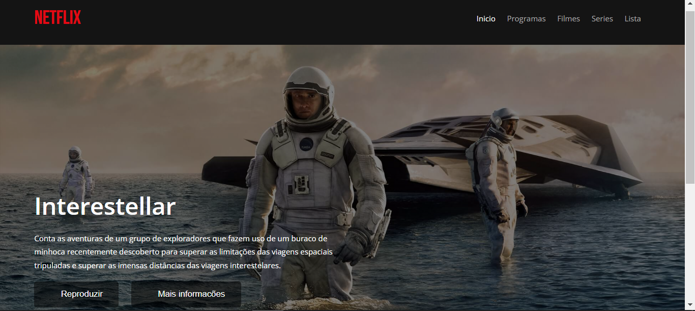
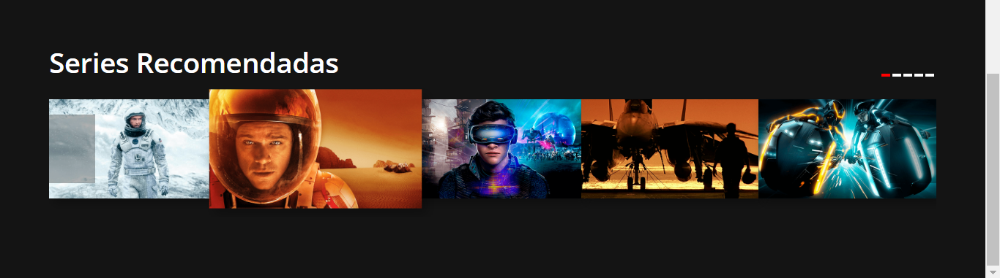
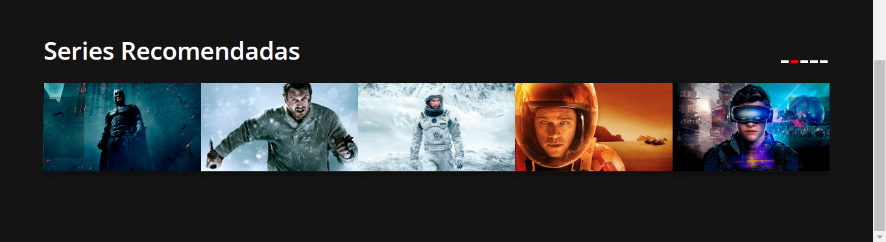

# CLONE DA NETFLIX 02
👨‍🏫INTERFACE DA PÁGINA INICIAL DA NETFLIX.

   
   
   

## DESCRIÇÃO:
- O aplicativo é um clone da interface do Netflix, projetado para exibir filmes e séries, bem como permitir a reprodução de vídeos.
- Ele apresenta um cabeçalho com o nome "Netflix" e um menu de navegação com links para as seções "Início", "Programas", "Filmes", "Séries" e "Lista".
- Há uma seção principal que exibe um destaque com o título "Interestelar", uma breve descrição e botões para "Reproduzir" e "Mais informações".
- Abaixo do destaque principal, há uma seção de "Séries Recomendadas" que inclui um carrossel de miniaturas de séries.
- Este aplicativo faz uso da biblioteca FontAwesome para os ícones. 

## EXECUTANDO O PROJETO:
1. Abra o arquivo `index.html` em um navegador da web.
2. **Navegação**: Use os links no cabeçalho para navegar pelas diferentes seções do aplicativo, como "Programas", "Filmes", etc.
3. **Assistir a um vídeo**: Clique no botão "Reproduzir" para iniciar a reprodução do vídeo em destaque.
4. **Obter mais informações**: Clique no botão "Mais Informações" para obter detalhes adicionais sobre o conteúdo em destaque.
5. **Explorar o carrossel de séries**: Use as setas à esquerda e à direita para navegar pelas séries recomendadas.

## NÃO SABE?
- Entendemos que para manipular arquivos em `HTML`, `CSS` e outras linguagens relacionadas, é necessário possuir conhecimento nessas áreas. Para auxiliar nesse aprendizado, oferecemos cursos gratuitos disponíveis:
* [CURSO DE HTML E CSS](https://github.com/VILHALVA/CURSO-DE-HTML-E-CSS)
* [CURSO DE JAVASCRIPT](https://github.com/VILHALVA/CURSO-DE-JAVASCRIPT)
* [CONFIRA MAIS CURSOS](https://github.com/VILHALVA?tab=repositories&q=+topic:CURSO)

## CREDITOS:
- [PROJETO CRIADO PELO "WofulDraco"](https://github.com/WofulDraco/113carrusel-2doparcial)
- [PROJETO EDITADO PELO VILHALVA](https://github.com/VILHALVA)

